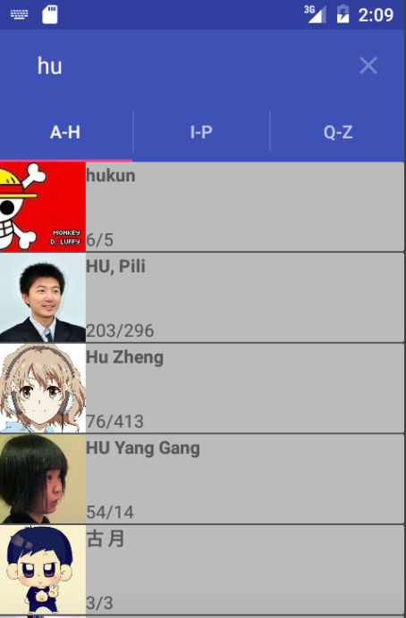

# Test github API

it uses 2 api-requists:  
1)https://api.github.com/search/users?q=bro&page=2&per_page=100  
2)https://api.github.com/users/brodjag?client_id=brodjag&client_secret=***

[load apk](https://dl.dropboxusercontent.com/u/33560671/apk/githubSeach.apk)

1)it returns seacherd user list (id, login,image-url etc). it has limit in 1K users in one seach .
 
2)it retrives information for every user (user-name, count of followers&following etc).
 it has count requist  limit < 1K :(

**used framoworks: retrofit, picasso, recyclerview, cardview etc.**

##app files
* [BlankFragment.java](https://github.com/brodjag/ghseach/blob/master/app/src/main/java/com/brodjag/githubapi/BlankFragment.java). this is main fragment with recyvlerView and filter function
* [MainActivity.java](https://github.com/brodjag/ghseach/blob/master/app/src/main/java/com/brodjag/githubapi/MainActivity.java) it is used as base of app. I makes comunication for other classes (networkSet, tabSet). It has userList to keep seach results. 
* [tabSet.java](https://github.com/brodjag/ghseach/blob/master/app/src/main/java/com/brodjag/githubapi/tabSet.java) . It makes tabs-bar and seach-bar.
* [networkSet.java](https://github.com/brodjag/ghseach/blob/master/app/src/main/java/com/brodjag/githubapi/networkSet.java) it does netwok communication and has data classes for user and userInfo. Please specify *LOGIN*  and *PASSWORD* to wide limits.
* [ServiceGenerator.java](https://github.com/brodjag/ghseach/blob/master/app/src/main/java/com/brodjag/githubapi/ServiceGenerator.java) it is a help class for networkSet.
